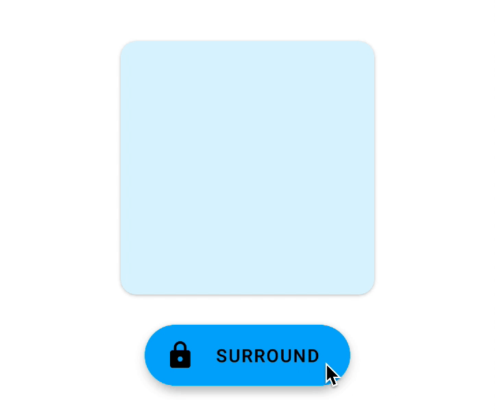
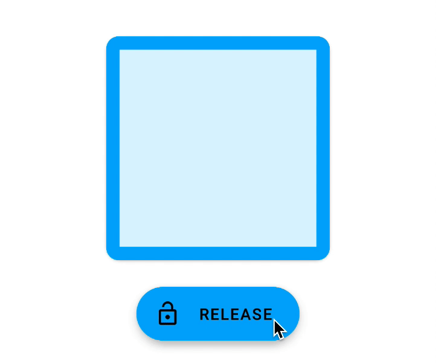
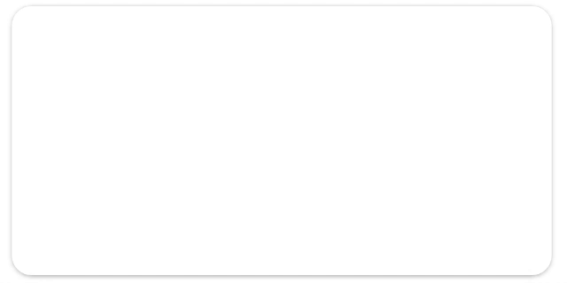
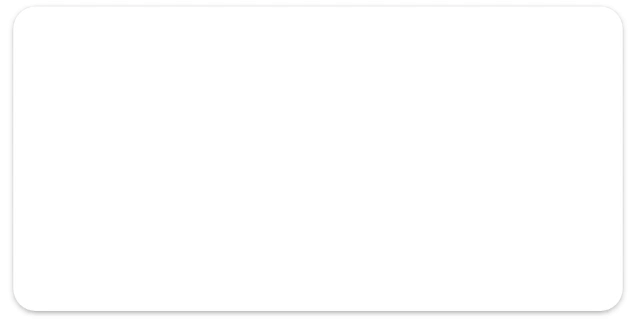
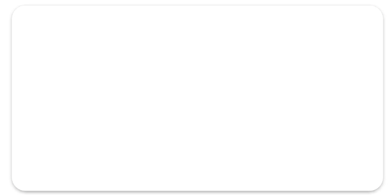
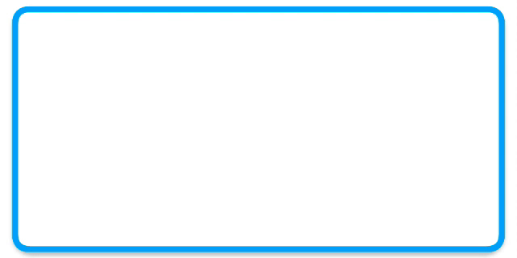
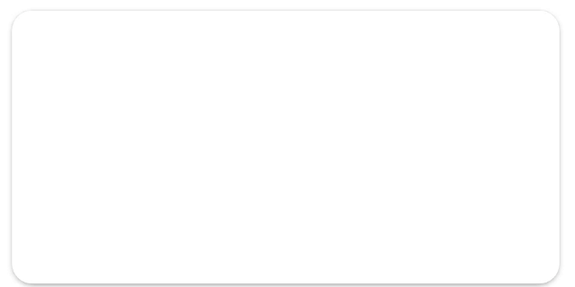
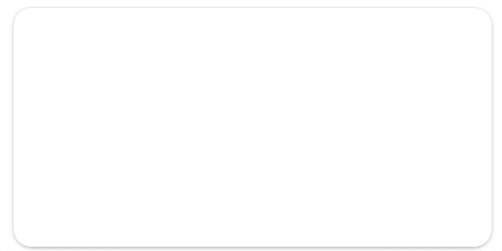
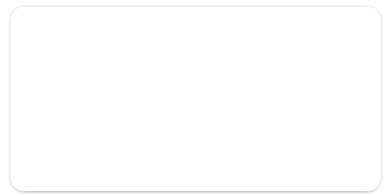
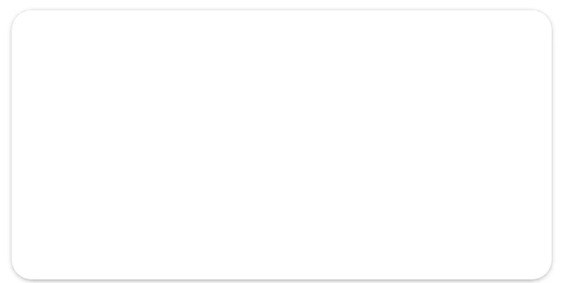

[](https://bintray.com/furkanakdemir/surroundcardview/com.furkanakdemir.surroundcardview/_latestVersion)


<p align="center">
  
</p>

## SurroundCardView

SurroundCardView is a special form of `MaterialCardView` that has animated stroke.

## Preview


## Setup

#### Gradle

Add `jcenter` to your build.gradle in the root project.

```gradle
allprojects {
    repositories {
        jcenter()
    }
}
```

Add the library to the `dependencies` section

```gradle
dependencies {
    implementation "com.furkanakdemir:surroundcardview:X.X.X"
}
```

## Usage

The example of `SurroundCardView` is the following:

```xml
<com.furkanakdemir.surroundcardview.SurroundCardView
    android:id="@+id/sampleSurroundCardView"
    android:layout_width="200dp"
    android:layout_height="200dp"
    app:cardCornerRadius="12dp"
    app:scv_duration="1000"
    app:scv_startPoint="bottom_start"
    app:scv_color="#03A9F4"
    app:scv_surrounded="true"
    app:scv_width="12dp" />
```

#### Attributes

| Attribute      |    Type    |  Default  | Description                                                       |
| :------------- | :--------: | :-------: | :---------------------------------------------------------------- |
| scv_duration   |  Integer   |    600    | the duration of a surround or a release animation in milliseconds |
| scv_width      | Dimension  |   4 dp    | the width of surrounding stroke                                   |
| scv_color      |   Color    |  #03A9F4  | the color of surrounding stroke                                   |
| scv_startPoint | StartPoint | top_start | the starting point of the animation                               |
| scv_surrounded |  Boolean   |   false   | the initial visibility of the stroke                              |

#### Surround & Release

|                  Surround                  |                  Release                  |
| :----------------------------------------: | :---------------------------------------: |
|  |  |
|    `sampleSurroundCardView.surround()`     |    `sampleSurroundCardView.release()`     |

#### Listener

You can set a listener to detect the ending of a surround or a release animation.

```kotlin
sampleSurroundCardView.surroundListener = object : SurroundListener {
    override fun onSurround() {
        // TODO
    }
}

sampleSurroundCardView.releaseListener = object : ReleaseListener {
    override fun onRelease() {
        // TODO
    }
}
```

#### Customization

You can customize `SurroundCardView` by changing the duration, stroke width, color, starting point, and initial state.

##### Duration



You can change the duration of a surround animation. This will affect both surround and release animations.

```kotlin
sampleSurroundCardView.setDuration(2000)
```

##### Stroke Width



You can change the width of a surrounding stroke by setting it as `DimenRes`.

```kotlin
sampleSurroundCardView.setSurroundStrokeWidth(R.dimen.stroke_width_custom))
```

##### Color



You can change the color of a surrounding stroke by setting it as `ColorRes`.

```kotlin
sampleSurroundCardView.setSurroundStrokeColor(R.color.customColor)
```

##### Initial State



```kotlin
sampleSurroundCardView.setSurrounded(true)
```

##### Starting Point

|           Top Start           |           Top End           |           Bottom Start           |           Bottom End           |
| :---------------------------: | :-------------------------: | :------------------------------: | :----------------------------: |
|  |  |  |  |

```kotlin
val startPoint = TOP_START | TOP_END | BOTTOM_START | BOTTOM_END
sampleSurroundCardView.setStartPoint(startPoint)
```

## Upcoming

- Support shape-theming
- Add a `toggle` API
- Change state even when the animation is running

## Contribution

If you've found an error in the library or sample, please file an issue.

Patches are encouraged, and may be submitted by forking this project and submitting a pull request.

If you contributed to `surroundcardview` but your name is not in the list, please feel free to add yourself!

- [Furkan Akdemir](https://github.com/furkanakdemir) - Maintainer

## License

    Copyright 2020 Furkan Akdemir

    Licensed under the Apache License, Version 2.0 (the "License");
    you may not use this file except in compliance with the License.
    You may obtain a copy of the License at

       http://www.apache.org/licenses/LICENSE-2.0

    Unless required by applicable law or agreed to in writing, software
    distributed under the License is distributed on an "AS IS" BASIS,
    WITHOUT WARRANTIES OR CONDITIONS OF ANY KIND, either express or implied.
    See the License for the specific language governing permissions and
    limitations under the License.
